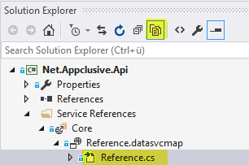

# Net.Appclusive.Api

## Add/Update Service References

When adding a service reference, proxy classes for all entity sets and complex types will be generated having exactly the same name and namespace. The entity sets and complex types are already defined in `Net.Appclusive.Public`. Unfortunately it's not possible to reuse types from another assembly (i.e. from `Net.Appclusive.Public`). Referencing `Net.Appclusive.Public` and `Net.Appclusive.Api` in the same project can cause problems as exactly the same types with the same namespace are defined twice. To workaround this problem the `alias` of the `Net.Appclusive.Api` reference can be changed as described [here](http://stackoverflow.com/questions/9194495/type-exists-in-2-assemblies/32038867#32038867).

**IMPORTANT**

After updating or adding a service reference the following steps have to be performed.

* Change service reference class in `Reference.cs` to extend from `DataServiceContextBase`

    
  
	`public partial class Core : DataServiceContextBase`

* The duplicated proxy classes (i.e. `User`) have to be deleted in the corresponding `Reference.cs` files
