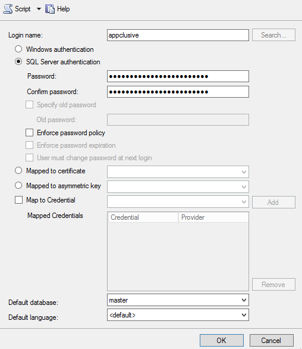
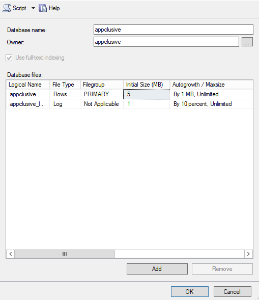

This page contains information about the initial installation of the various components of the Appclusive Blueprint Modelling and Automation Engine.

# SQL Server

## Hardware Specification

Name | Value
----|---
CPU | 4
Memory | 8GB
Installed Software | Windows Server 2012 R2

## Prerequisites

* MSSQL
* SQL Server Management Studio

## Procedure

1. Create SQL login user `appclusive`

    

1. Create new database `appclusive` with owner `appclusive`

    

1. Set `Default database` of `appclusive` user to `appclusive`

# Service Bus Server

## Hardware Specification

Name | Value
----|---
CPU | 4
Memory | 8GB
Installed Software | Windows Server 2012 R2

## Prerequisites

* [Microsoft WebPI 5.0](https://go.microsoft.com/?linkid=9737537)
* PoSH Modules
    * [biz.dfch.PS.System.Logging](https://www.nuget.org/packages/biz.dfch.PS.System.Logging/)
    * [biz.dfch.PS.Azure.ServiceBus.Management](https://www.nuget.org/packages/biz.dfch.PS.Azure.ServiceBus.Management/)

## Procedure

# Core/Worker Server

## Hardware Specification

Name | Value
----|---
CPU | 4
Memory | 8GB
Installed Software | Windows Server 2008 R2 or Windows Server 2012 R2

## Prerequisites

First install all pending Windows updates on the target machine. Then as a part of preparation of the new machine install the following tools

## Procedure

