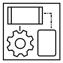

**This is the documentation for the [Appclusive&reg; Blueprint Modelling and Automation Engine](https://github.com/Appclusive)**

# Introduction

Appclusive&reg; is primarily a *framework* that helps you automate business and technical processes. Appclusive accomplishes this by letting you define *behaviours*, *models* and *attributes* which are then connected to some user defined execution logic (such as workflows, functions or scripts).

From this perspective it looks like Appclusive is just as any other workflow engine where you might define and run several workflows for a complete business process. But in contrast to regular workflow engines, Appclusive lets you wrap these workflows into a well-defined and self-contained *blueprint* and guarantees their execution inside your defined boundaries. Thus a *blueprint* defines a complete life-cycle of any model (based on a finite state machine) and does not restrict you to one-shot provisionings but embraces devops and day-two operations. 

Furthermore Appclusive does not care about which workflow engine product you use, but allows you to use virtually any workflow engine or technology that fits your need as long as your workflows adhere to a pre-defined calling convention. This is accomplished by using an open and flexible plugin system where integrators and/or customers can create support for their own workflow engines. 

To facilitate re-using and rapid modelling Appclusive lets you combine several blueprints and models into new blueprints which can be mixed across business organisations and customers.

In addition to these *blueprints* Appclusive provides a common fully multi-tenant aware inventory across all instantiated models and behaviours to support your ongoing maintenance regardless of whether you follow a classic IT Service Management or more of a devops approach (or a combination thereof).

The whole inventory is driven by the models and their interactions and supports a fine-grained permission model (based on roles and access-control lists).

All this information is available via a (ODATA based) REST API with full introspection and server-side validation of every customer defined model (along with their attributes).

For further information see our [Examples](Examples/) section.

# Installation

Information about the setup, installation and troubleshooting can be found [here](Installation/).

# Versions and Updates

* see [What's new?](ReleaseNotes/) for latest changes
* for the latest vesion of this documentation, make sure you check the [develop](../develop/) branch of this documentation

 
 
 

# Copyright

 This documentation is licensed under a <a rel="license" href="http://creativecommons.org/licenses/by-nc-nd/4.0/">Creative Commons Attribution-NonCommercial-NoDerivatives 4.0 International License</a>.

Copyright 2013-2017 [d-fens GmbH](http://d-fens.net), General-Guisan-Strasse 6, CH-6300 Zug, Switzerland

Appclusive and the Appclusive logo are a registered trademarks in [Switzerland](https://www.swissreg.ch/srclient/tm/691777) and/or other countries.
